#  임수현 (Suhyun Lim)
### iOS Developer 
Swift, Objective-C 

### Contact.
 ✉️ dlatngusch@gmail.com 
📍 github.com/heyKaren 
🔗 www.linkedin.com/in/heyKaren 

## Education.
### 서울여자대학교 학사 
2013.03 - 2017.02 

## Work Experience.
### 가온소프트 (Kaonsoft) 
iOS Developer 
2018.07 - 2020.02 

### 에이치투오시스템테크놀로지 (H2Osystemtechnology) 
SW Engineer 
2016.07 - 2018.02 

## Work Experience.

### KAI (iOS) 
- 2019.11 ~ 2020.02
- 소속 : 가온소프트
- IOT Mobile Platform 개발

### KEMP (iOS) 
- 2018.07 ~ 2020.02
- 소속 : 가온소프트
- Hybrid 기반 KEMP App Platform 고도화
- Objective-C to Swift 리뉴얼 개발

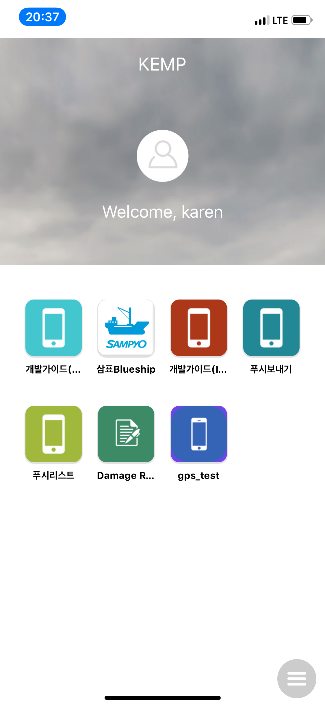
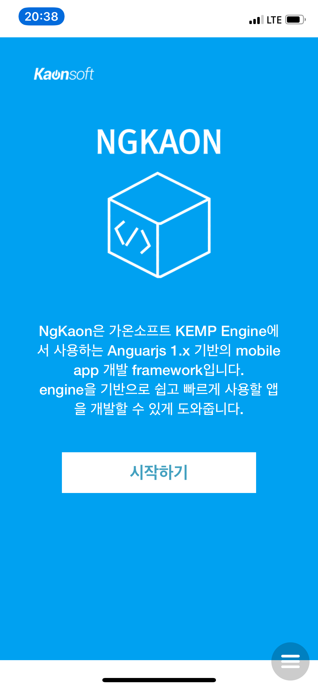
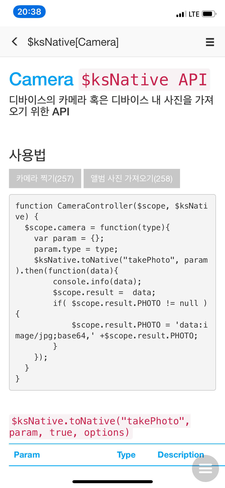

 

### KEMP Settings (iOS) 
- 2018.08 ~ 2020.02
- 소속 : 가온소프트
- Keychain Group을 사용한 자사 배포 앱 관리 / 개발 용 Navtive App 개발

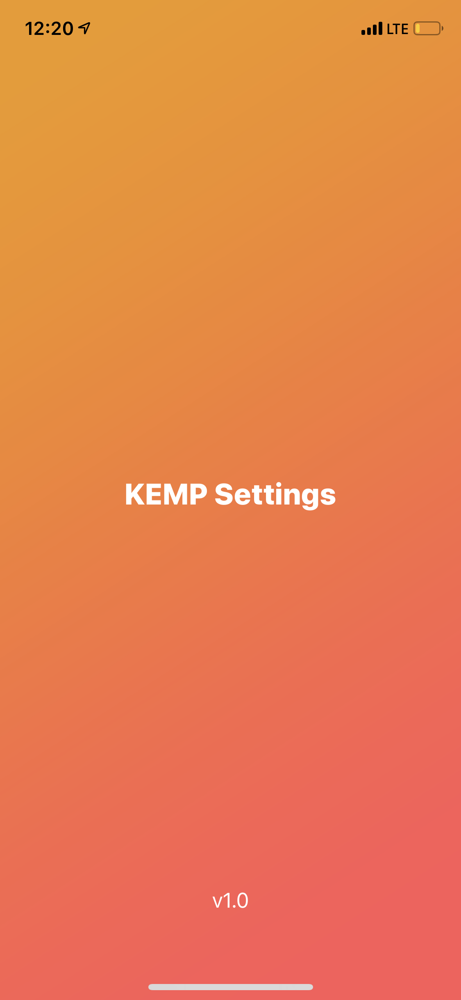
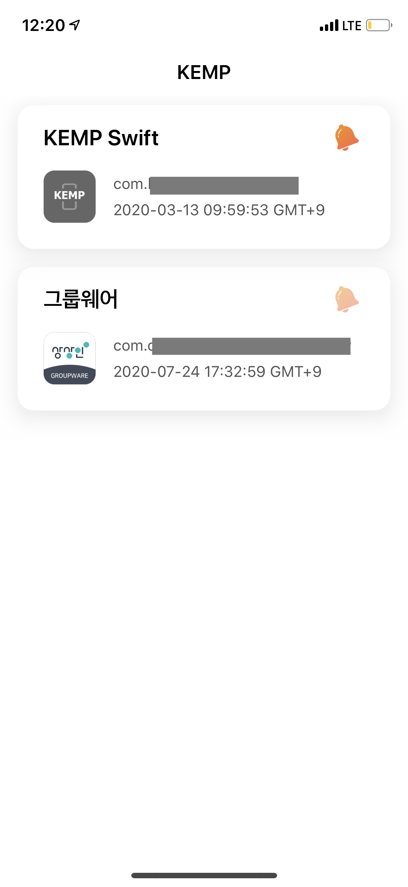
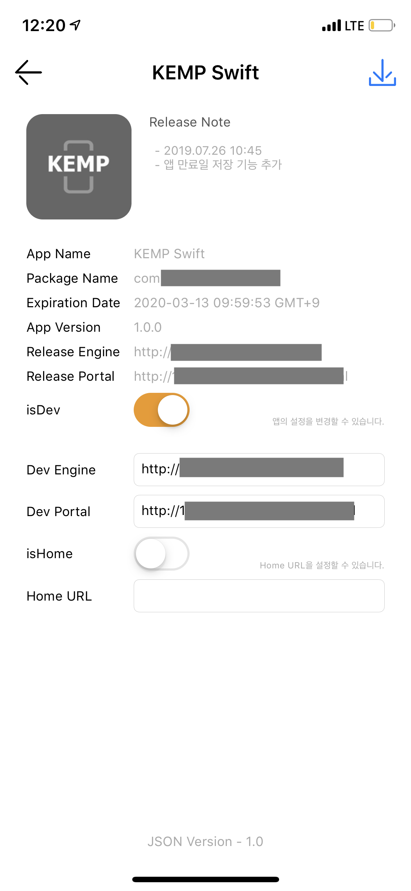

 

### HiREN (iOS) 
- 2017.09 ~ 2018.02
- 소속 : 에이치투오시스템테크놀로지
- 자사 Push Library  기반 Native App 개발
- 신규 기능 개발 및 유지보수
- 주요 기능 : 채팅, 연락처 동기화, Push

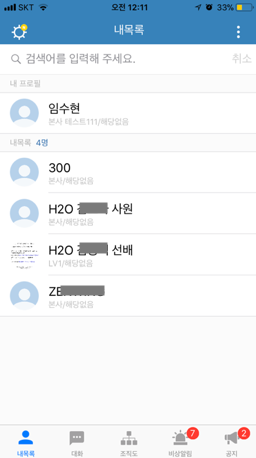
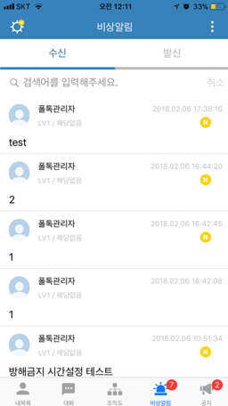
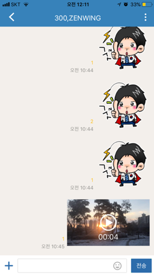

 

### TiTAN SmartBroker (iOS) 
- 2017.09 ~ 2018.02
- 소속 : 에이치투오시스템테크놀로지
- C기반 iOS Push Library
- Objective-C
- 유지보수 및 기술지원

### PDR 시스템 개발사업 (Android) 
- 2016.08 ~ 2017.06
- 소속 : 에이치투오시스템테크놀로지
- DDS Protocol을 사용한 Data Pub/Sub 가능한 프로토타입 App 개발

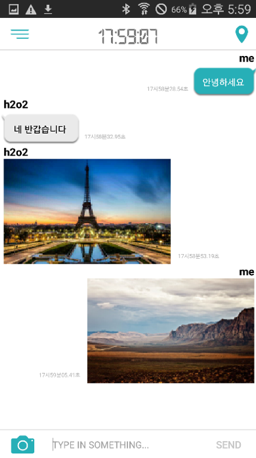
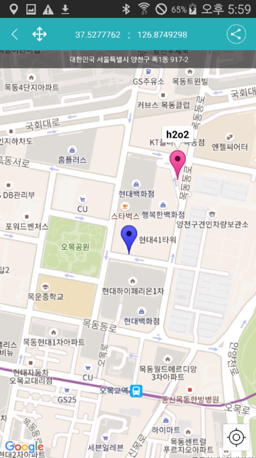
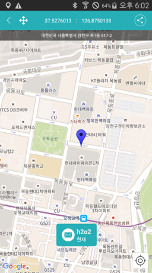

 

### 실시간 L-V-C 연동 통신 미들웨어 프레임워크 개발 사업 (Windows) 
- 2017.03 ~ 2017.12
- 소속 : 에이치투오시스템테크놀로지
- C++ MDI, MFC
- Visual Studio 2010

## Personal Experience.
### 별별일기 (iOS) 
별처럼 빛나는 당신의 하루, 
별자리 운세 일기를 기록해보세요.  
- 개발 기간 2019.12 - 2020.03 
- 서비스 기간 2020.04 - 현재 
- 소속 Mash-Up 
- 사용 기술 Swift, Moya, SwiftLint, SnapKit FCM 등 
- 다운로드 <https://apps.apple.com/app/id1500714424/>  

**미리보기** 

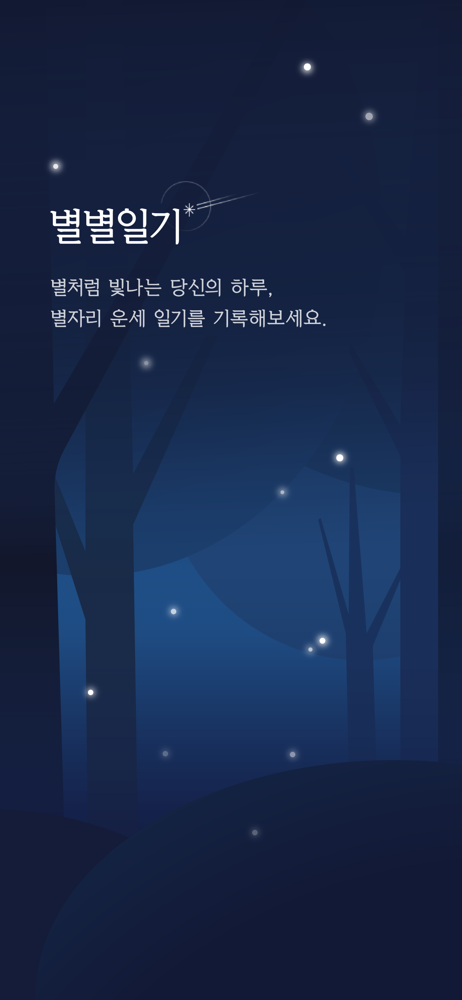
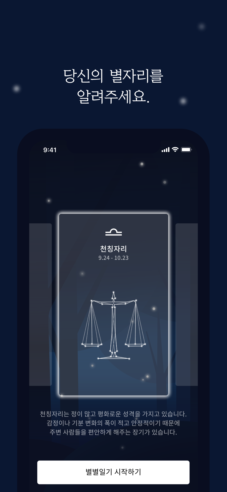
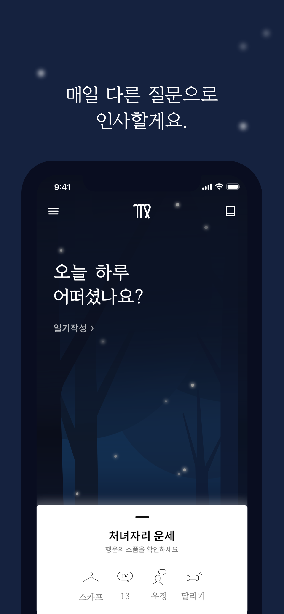
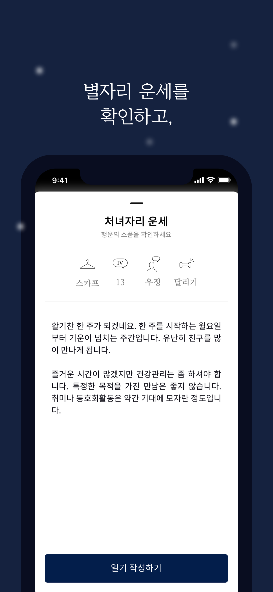
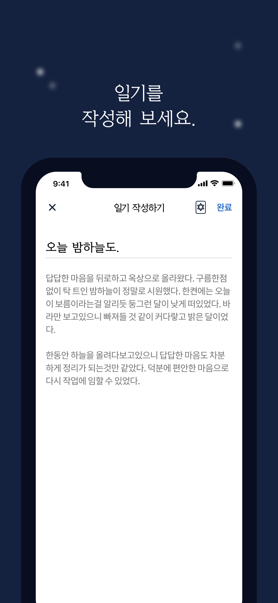

 

### 감쓰 (iOS) 
감정쓰레기, 버리기만 하세요 
청소는 감정청소부가 해줄게요! 
감정쓰레기를 정리해줄 나만의 비밀 '감정쓰레기통', 감쓰  
- 개발 기간 2018.03 - 2018.07 
- 서비스 기간 2018.09 - 현재 
- 사용 기술 Swift, Realm, FCM 등 
- 다운로드 <https://itunes.apple.com/kr/app/id1400251239/>  

**미리보기** 

<video width="150" controls="controls" autoplay="autoplay">
<source src="./emotiontrash/preview_iphonex.mp4"/>
</video>

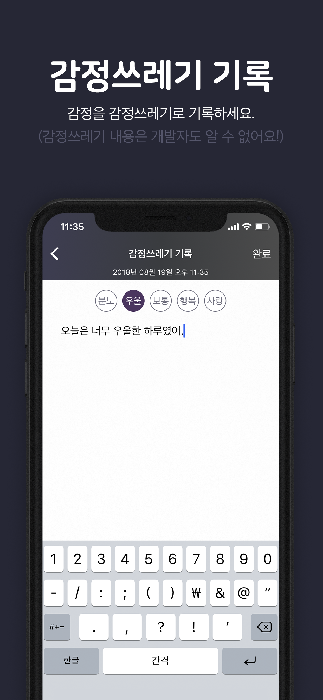
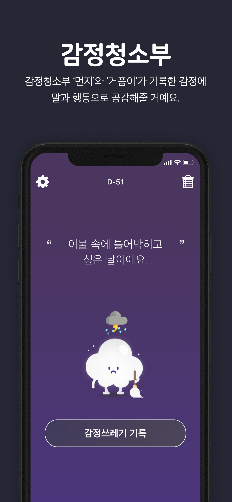

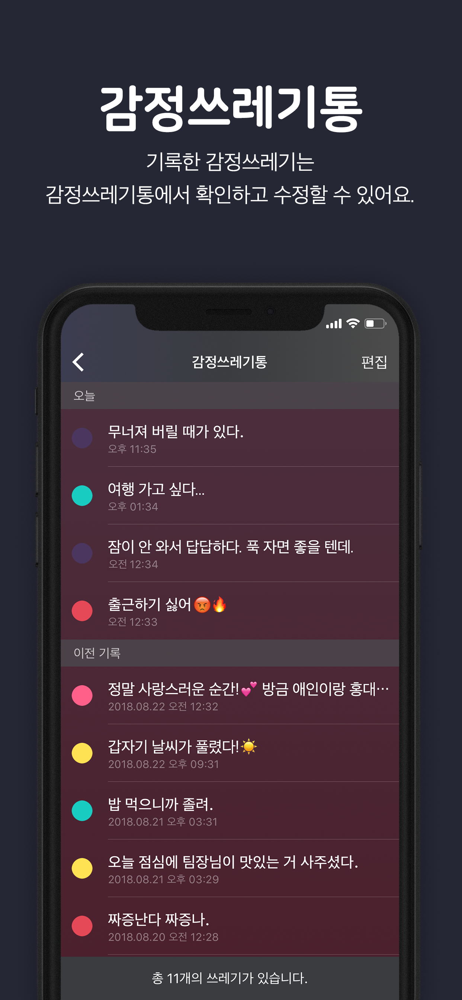
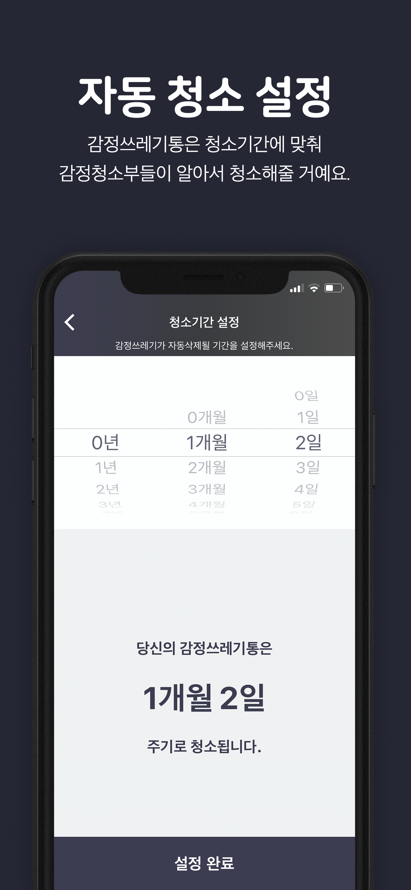
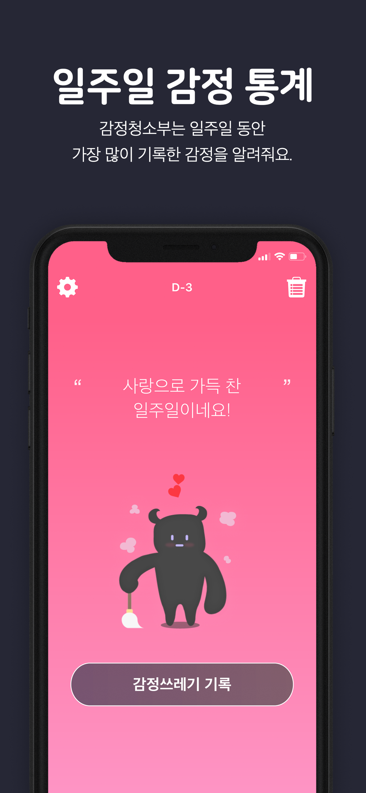
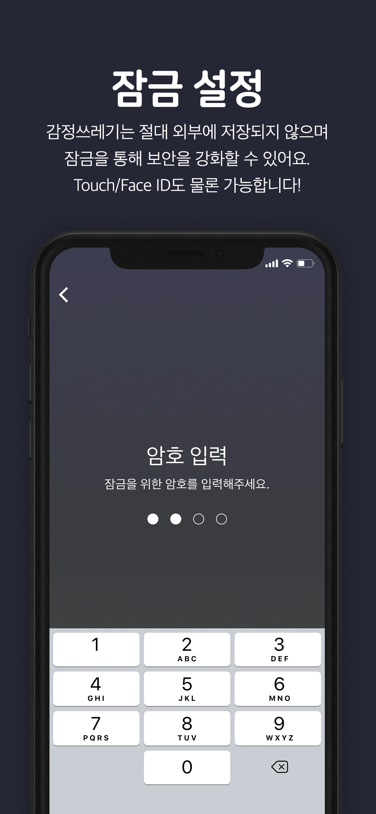

 

**앱스토어 전체 6위** 🥳 
**라이프스타일 1위**  🥳 

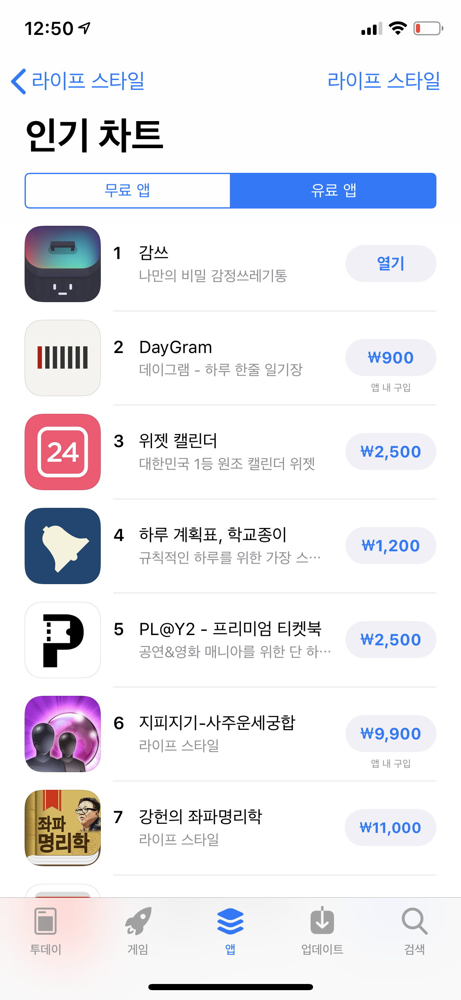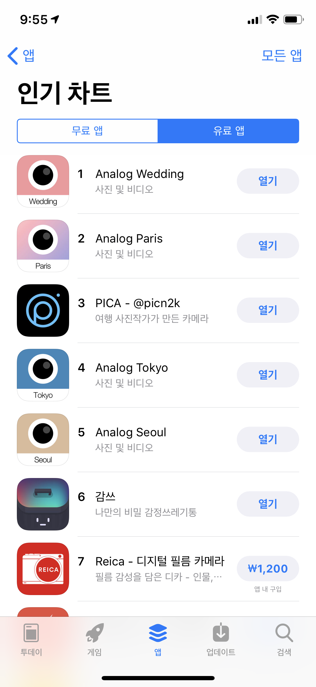

  

- 다수 기사 및 인터뷰 첨부   
조선일보  
<http://news.chosun.com/site/data/html_dir/2018/09/14/2018091402196.html?rsMobile=falsejSVblY4t-4SmN_Jag5E#Redyho/> 
울산종합일보   
<http://www.ujnews.co.kr/news/articleView.html?idxno=436103/> 
얼루어(allure)   
<http://www.allurekorea.com/2018/10/30/%EB%9E%9C%EC%84%A0-%ED%9E%90%EB%A7%81/> 
동아일보   
<http://www.donga.com/news/article/all/20190411/95008509/1/> 
DI투데이   
<http://www.ditoday.com/articles/articles_view.html?idno=22808/> 

